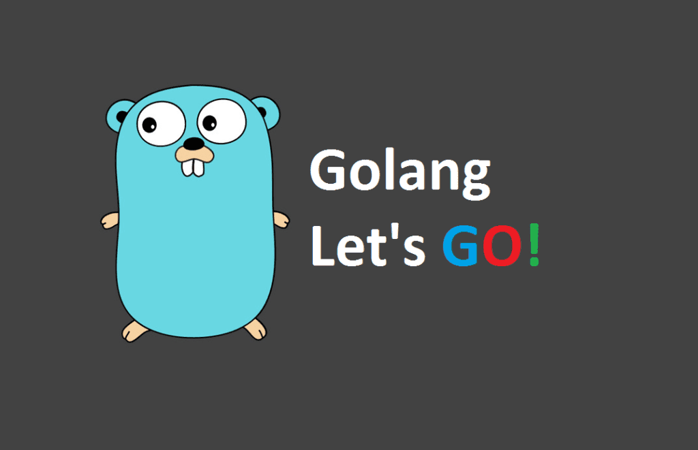

# GO_baby_step
-> GO语言入门学习资料以及datawhale go开源学习笔记整理

## GO开源电子书

1. Go语言圣经https://www.kancloud.cn/hartnett/gopl-zh/126044
2. Effective GO https://learnku.com/docs/effective-go/2020
3. Go语言设计与实现 [https://draveness.me/golang/docs/part3-runtime/](https://draveness.me/golang/docs/part3-runtime/ch06-concurrency/golang-context/)

## 新手练习项目

参考：

[go-talent](https://github.com/datawhalechina/go-talent)

[有没有推荐的golang的练手项目？](https://www.zhihu.com/search?type=content&q=go练习项目)

[7天用Go从零实现系列](https://github.com/geektutu/7days-golang)

- [x] 0.Go初探

- [x] 1.数据类型、关键字、标识符

- [x] 2.变量、常量、枚举
- [x] 3.运算符、控制语句

- [x] 4.字典、字符串

- [x] 5.数组、切片

- [x] 6.函数

7.结构体、方法、接口

- [x] 8.包管理

9.异常处理

10.反射机制

11.单元测试

12.并发编程

